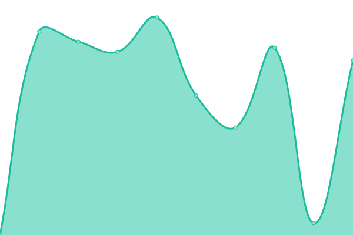

# [📈 Live Status](https://paywatchglobal.github.io/upptime): <!--live status--> **🟩 All systems operational**

This repository contains the open-source uptime monitor and status page for [paywatchglobal](https://paywatchglobal.github.io/upptime), powered by [Upptime](https://github.com/upptime/upptime).

With [Upptime](https://upptime.js.org), you can get your own unlimited and free uptime monitor and status page, powered entirely by a GitHub repository. We use [Issues](https://github.com/paywatchglobal/upptime/issues) as incident reports, [Actions](https://github.com/paywatchglobal/upptime/actions) as uptime monitors, and [Pages](https://paywatchglobal.github.io/upptime) for the status page.

<!--start: status pages-->
<!-- This summary is generated by Upptime (https://github.com/upptime/upptime) -->
<!-- Do not edit this manually, your changes will be overwritten -->
<!-- prettier-ignore -->
| URL | Status | History | Response Time | Uptime |
| --- | ------ | ------- | ------------- | ------ |
|  [Production Business-Logic services](https://20.24.157.72/agghealth/health) | 🟩 Up | [production-business-logic-services.yml](https://github.com/paywatchglobal/upptime/commits/HEAD/history/production-business-logic-services.yml) | 

 4243ms
     
 | 

<a href="https://paywatchglobal.github.io/upptime/history/production-business-logic-services">100.00%</a>
    

|  [Production Employee Consent Services](https://20.24.157.72/agghealth/health) | 🟩 Up | [production-employee-consent-services.yml](https://github.com/paywatchglobal/upptime/commits/HEAD/history/production-employee-consent-services.yml) | 

 3329ms
     
 | 

<a href="https://paywatchglobal.github.io/upptime/history/production-employee-consent-services">100.00%</a>
    

|  [Production Employer Services](https://20.24.157.72/agghealth/health) | 🟩 Up | [production-employer-services.yml](https://github.com/paywatchglobal/upptime/commits/HEAD/history/production-employer-services.yml) | 

 3294ms
     
 | 

<a href="https://paywatchglobal.github.io/upptime/history/production-employer-services">100.00%</a>
    

|  [Production Integration-Related Services](https://20.24.157.72/agghealth/health) | 🟩 Up | [production-integration-related-services.yml](https://github.com/paywatchglobal/upptime/commits/HEAD/history/production-integration-related-services.yml) | 

 3642ms
     
 | 

<a href="https://paywatchglobal.github.io/upptime/history/production-integration-related-services">100.00%</a>
    

|  [Production Payment-related Services](https://20.24.157.72/agghealth/health) | 🟩 Up | [production-payment-related-services.yml](https://github.com/paywatchglobal/upptime/commits/HEAD/history/production-payment-related-services.yml) | 

 3552ms
     
 | 

<a href="https://paywatchglobal.github.io/upptime/history/production-payment-related-services">100.00%</a>
    

|  [Production Rule Engine Service](https://20.24.157.72/agghealth/health) | 🟩 Up | [production-rule-engine-service.yml](https://github.com/paywatchglobal/upptime/commits/HEAD/history/production-rule-engine-service.yml) | 

 3918ms
     
 | 

<a href="https://paywatchglobal.github.io/upptime/history/production-rule-engine-service">100.00%</a>
    

|  [Production Utility services](https://20.24.157.72/agghealth/health) | 🟩 Up | [production-utility-services.yml](https://github.com/paywatchglobal/upptime/commits/HEAD/history/production-utility-services.yml) | 

 3525ms
     
 | 

<a href="https://paywatchglobal.github.io/upptime/history/production-utility-services">100.00%</a>
    

|  [Production Consent Form Website](https://form.paywatchglobal.com/id-ID/wilmar-indonesia) | 🟩 Up | [production-consent-form-website.yml](https://github.com/paywatchglobal/upptime/commits/HEAD/history/production-consent-form-website.yml) | 

 1889ms
     
 | 

<a href="https://paywatchglobal.github.io/upptime/history/production-consent-form-website">100.00%</a>
    

|  [Production Employer Portal Website](https://employer.myadmin.paywatchglobal.com) | 🟩 Up | [production-employer-portal-website.yml](https://github.com/paywatchglobal/upptime/commits/HEAD/history/production-employer-portal-website.yml) | 

 1185ms
     
 | 

<a href="https://paywatchglobal.github.io/upptime/history/production-employer-portal-website">100.00%</a>
    

|  [Production myadmin CDN Website](https://myadmin.paywatchglobal.com/) | 🟩 Up | [production-myadmin-cdn-website.yml](https://github.com/paywatchglobal/upptime/commits/HEAD/history/production-myadmin-cdn-website.yml) | 

 2ms
     
 | 

<a href="https://paywatchglobal.github.io/upptime/history/production-myadmin-cdn-website">100.00%</a>
    

<!--end: status pages-->

[**Visit our status website →**](https://paywatchglobal.github.io/upptime)

## 📄 License

- Powered by: [Upptime](https://github.com/upptime/upptime)
- Code: [MIT](./LICENSE) © [Anand Chowdhary](https://anandchowdhary.com), supported by [Pabio](https://pabio.com)
- Data in the `./history` directory: [Open Database License](https://opendatacommons.org/licenses/odbl/1-0/)
