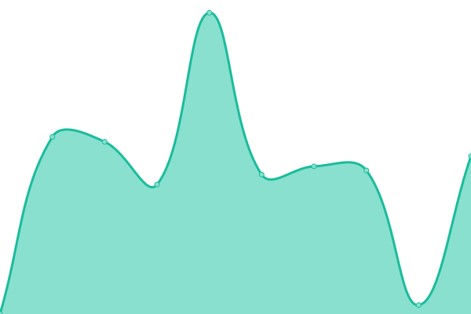

# [📈 Live Status](https://paywatchglobal.github.io/upptime): <!--live status--> **🟩 All systems operational**

This repository contains the open-source uptime monitor and status page for [paywatchglobal](https://paywatchglobal.github.io/upptime), powered by [Upptime](https://github.com/upptime/upptime).

With [Upptime](https://upptime.js.org), you can get your own unlimited and free uptime monitor and status page, powered entirely by a GitHub repository. We use [Issues](https://github.com/paywatchglobal/upptime/issues) as incident reports, [Actions](https://github.com/paywatchglobal/upptime/actions) as uptime monitors, and [Pages](https://paywatchglobal.github.io/upptime) for the status page.

<!--start: status pages-->
<!-- This summary is generated by Upptime (https://github.com/upptime/upptime) -->
<!-- Do not edit this manually, your changes will be overwritten -->
<!-- prettier-ignore -->
| URL | Status | History | Response Time | Uptime |
| --- | ------ | ------- | ------------- | ------ |
|  [Business Logic Admin](https://20.24.157.72/agghealth/health) | 🟩 Up | [business-logic-admin.yml](https://github.com/paywatchglobal/upptime/commits/HEAD/history/business-logic-admin.yml) | 

 4381ms
     
 | 

<a href="https://paywatchglobal.github.io/upptime/history/business-logic-admin">100.00%</a>
    

|  [Business Logic Work](https://20.24.157.72/agghealth/health) | 🟩 Up | [business-logic-work.yml](https://github.com/paywatchglobal/upptime/commits/HEAD/history/business-logic-work.yml) | 

 3765ms
     
 | 

<a href="https://paywatchglobal.github.io/upptime/history/business-logic-work">100.00%</a>
    

|  [Business Logic User](https://20.24.157.72/agghealth/health) | 🟩 Up | [business-logic-user.yml](https://github.com/paywatchglobal/upptime/commits/HEAD/history/business-logic-user.yml) | 

 3618ms
     
 | 

<a href="https://paywatchglobal.github.io/upptime/history/business-logic-user">100.00%</a>
    

|  [Business Logic Report](https://20.24.157.72/agghealth/health) | 🟩 Up | [business-logic-report.yml](https://github.com/paywatchglobal/upptime/commits/HEAD/history/business-logic-report.yml) | 

 3919ms
     
 | 

<a href="https://paywatchglobal.github.io/upptime/history/business-logic-report">100.00%</a>
    

|  [Business Logic General](https://20.24.157.72/agghealth/health) | 🟩 Up | [business-logic-general.yml](https://github.com/paywatchglobal/upptime/commits/HEAD/history/business-logic-general.yml) | 

 3688ms
     
 | 

<a href="https://paywatchglobal.github.io/upptime/history/business-logic-general">100.00%</a>
    

|  [Business Logic Finance](https://20.24.157.72/agghealth/health) | 🟩 Up | [business-logic-finance.yml](https://github.com/paywatchglobal/upptime/commits/HEAD/history/business-logic-finance.yml) | 

 3846ms
     
 | 

<a href="https://paywatchglobal.github.io/upptime/history/business-logic-finance">100.00%</a>
    

|  [Business Logic Integration](https://20.24.157.72/agghealth/health) | 🟩 Up | [business-logic-integration.yml](https://github.com/paywatchglobal/upptime/commits/HEAD/history/business-logic-integration.yml) | 

 3323ms
     
 | 

<a href="https://paywatchglobal.github.io/upptime/history/business-logic-integration">100.00%</a>
    

|  [Production Employee Consent Services](https://20.24.157.72/agghealth/health) | 🟩 Up | [production-employee-consent-services.yml](https://github.com/paywatchglobal/upptime/commits/HEAD/history/production-employee-consent-services.yml) | 

 3774ms
     
 | 

<a href="https://paywatchglobal.github.io/upptime/history/production-employee-consent-services">100.00%</a>
    

|  [Production Employer Services](https://20.24.157.72/agghealth/health) | 🟩 Up | [production-employer-services.yml](https://github.com/paywatchglobal/upptime/commits/HEAD/history/production-employer-services.yml) | 

 3729ms
     
 | 

<a href="https://paywatchglobal.github.io/upptime/history/production-employer-services">100.00%</a>
    

|  [Integration-Communication](https://20.24.157.72/agghealth/health) | 🟩 Up | [integration-communication.yml](https://github.com/paywatchglobal/upptime/commits/HEAD/history/integration-communication.yml) | 

 3905ms
     
 | 

<a href="https://paywatchglobal.github.io/upptime/history/integration-communication">100.00%</a>
    

|  [Integration-HRMS](https://20.24.157.72/agghealth/health) | 🟩 Up | [integration-hrms.yml](https://github.com/paywatchglobal/upptime/commits/HEAD/history/integration-hrms.yml) | 

 3539ms
     
 | 

<a href="https://paywatchglobal.github.io/upptime/history/integration-hrms">100.00%</a>
    

|  [Integration-Reward](https://20.24.157.72/agghealth/health) | 🟩 Up | [integration-reward.yml](https://github.com/paywatchglobal/upptime/commits/HEAD/history/integration-reward.yml) | 

 3846ms
     
 | 

<a href="https://paywatchglobal.github.io/upptime/history/integration-reward">100.00%</a>
    

|  [Integration-Service](https://20.24.157.72/agghealth/health) | 🟩 Up | [integration-service.yml](https://github.com/paywatchglobal/upptime/commits/HEAD/history/integration-service.yml) | 

 3787ms
     
 | 

<a href="https://paywatchglobal.github.io/upptime/history/integration-service">100.00%</a>
    

|  [Payment Service](https://20.24.157.72/agghealth/health) | 🟩 Up | [payment-service.yml](https://github.com/paywatchglobal/upptime/commits/HEAD/history/payment-service.yml) | 

 4151ms
     
 | 

<a href="https://paywatchglobal.github.io/upptime/history/payment-service">100.00%</a>
    

|  [Payout Service](https://20.24.157.72/agghealth/health) | 🟩 Up | [payout-service.yml](https://github.com/paywatchglobal/upptime/commits/HEAD/history/payout-service.yml) | 

 3735ms
     
 | 

<a href="https://paywatchglobal.github.io/upptime/history/payout-service">100.00%</a>
    

|  [Production Rule Engine Service](https://20.24.157.72/agghealth/health) | 🟩 Up | [production-rule-engine-service.yml](https://github.com/paywatchglobal/upptime/commits/HEAD/history/production-rule-engine-service.yml) | 

 3920ms
     
 | 

<a href="https://paywatchglobal.github.io/upptime/history/production-rule-engine-service">100.00%</a>
    

|  [Production Utility services](https://20.24.157.72/agghealth/health) | 🟩 Up | [production-utility-services.yml](https://github.com/paywatchglobal/upptime/commits/HEAD/history/production-utility-services.yml) | 

 3522ms
     
 | 

<a href="https://paywatchglobal.github.io/upptime/history/production-utility-services">100.00%</a>
    

|  [Production Consent Form Website](https://form.paywatchglobal.com/id-ID/wilmar-indonesia) | 🟩 Up | [production-consent-form-website.yml](https://github.com/paywatchglobal/upptime/commits/HEAD/history/production-consent-form-website.yml) | 

 1923ms
     
 | 

<a href="https://paywatchglobal.github.io/upptime/history/production-consent-form-website">99.77%</a>
    

|  [Production Employer Portal Website](https://employer.myadmin.paywatchglobal.com) | 🟩 Up | [production-employer-portal-website.yml](https://github.com/paywatchglobal/upptime/commits/HEAD/history/production-employer-portal-website.yml) | 

 1231ms
     
 | 

<a href="https://paywatchglobal.github.io/upptime/history/production-employer-portal-website">99.77%</a>
    

|  [Production myadmin CDN Website](https://myadmin.paywatchglobal.com/) | 🟩 Up | [production-myadmin-cdn-website.yml](https://github.com/paywatchglobal/upptime/commits/HEAD/history/production-myadmin-cdn-website.yml) | 

 17ms
     
 | 

<a href="https://paywatchglobal.github.io/upptime/history/production-myadmin-cdn-website">100.00%</a>
    

<!--end: status pages-->

[**Visit our status website →**](https://paywatchglobal.github.io/upptime)

## 📄 License

- Powered by: [Upptime](https://github.com/upptime/upptime)
- Code: [MIT](./LICENSE) © [Anand Chowdhary](https://anandchowdhary.com), supported by [Pabio](https://pabio.com)
- Data in the `./history` directory: [Open Database License](https://opendatacommons.org/licenses/odbl/1-0/)
